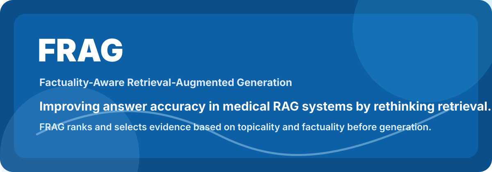

# FRAG: Factuality-Aware Retrieval-Augmented Generation

> A medical RAG research project that matches retrieved evidence by both topical relevance and factual reliability before prompting an LLM.

[](#requirements)
[](#what-this-repository-contains)
[](#evaluation)
[](#medical-safety-note)

<p align="center">
  
</p>

FRAG explores a simple question: can a medical QA system answer more accurately when retrieval matches evidence by both topicality and factuality?

Standard RAG retrieves passages that are semantically close to a user question. In high-stakes domains such as medicine, relevance alone is not enough: a passage can be on-topic and still be unreliable, misleading, or scientifically weak. FRAG adds factuality matching inside the retrieval phase: it retrieves a broad candidate pool and reranks those candidates before the final context is selected for the LLM. The goal is to improve answer accuracy by improving the quality of the evidence placed in the prompt.

Unlike approaches that first select a small top-N context and then filter or refine it with a classifier, FRAG operates before final context selection. In the current evaluation workflow, FRAG uses the top 100 retrieved candidate passages from the Step 2 inputs, reranks that candidate set using both topicality and factuality, then selects the final top-k evidence for generation.

In FRAG, factuality scores are properties of documents and passages. They can be computed offline, stored with the retrieval corpus, and fetched at execution time. This means the online ranking mechanism directly combines the query-dependent topicality score with the precomputed factuality score for each candidate passage; it does not need to run a factuality classifier during every Streamlit or inference request.

## Highlights

- **Retrieval-phase reranking:** retrieves a broad candidate pool and reranks it before final context selection.
- **Offline factuality metadata:** stores factuality as document/passages scores that can be computed once and reused at execution time.
- **Topicality and factuality matching:** selects passages that are both relevant to the question and estimated to be factually reliable.
- **Medical QA focus:** experiments target MIRAGE-style multiple-choice biomedical and clinical question answering.
- **Two factuality strategies:** source-based and claim-based classifiers trained with PubMedBERT-style models.
- **Reproducible evaluation workflow:** prompt-load generation, validation, vLLM inference support, and metric scripts are organized under `llm_frag_evaluation/`.
- **HPC-ready execution:** includes CINECA-oriented SLURM templates and runbooks for large-model inference.

## How FRAG Works

```text
Question
  |
  v
Topical retriever
  |
  v
100 candidate passages with topicality scores
  |
  v
Fetch offline factuality scores
  |
  v
Rank with topicality + factuality
  |
  v
Final top-k relevant and factually reliable context
  |
  v
LLM answer generation
```

The default FRAG ranking score used by the evaluation package is:

```text
final_score = alpha * normalized_topicality + (1 - alpha) * factuality
```

with `alpha = 0.6` by default, weighting topical relevance at 60 percent and factuality at 40 percent. Topicality is query-dependent and produced by the retriever; factuality is a precomputed document/passage property. The ranking mechanism directly considers both scores during retrieval-phase reranking, before the final top-k context is passed to the generator.

## What This Repository Contains

```text
FRAG/
  MedRAG/                         # Adapted MedRAG toolkit and retrieval pipeline
  MIRAGE/                         # MIRAGE benchmark utilities and data structure
  Model - Copia/                  # Factuality classifier training and analysis scripts
  llm_frag_evaluation/            # FRAG prompt generation, inference, validation, metrics
  README.md                       # Project landing page
  docs/                           # Stable documentation and CINECA runbooks
  tomorrow.md                     # Working notes
```

### Main Components

| Component | Purpose |
| --- | --- |
| `MedRAG/` | Medical retrieval-augmented generation toolkit used as the retrieval and generation base. |
| `MIRAGE/` | Benchmark utilities for medical QA evaluation. |
| `Model - Copia/` | Source-based and claim-based factuality model experiments. |
| `llm_frag_evaluation/` | Current experiment pipeline for zero-shot, standard RAG, and FRAG comparisons. |

## Evaluation

The active evaluation package compares three prompting settings:

| Setting | Description |
| --- | --- |
| `zero_shot` | Question and answer options only. No retrieval. |
| `standard_rag` | Question, answer options, instructions, and top-32 topically relevant passages. |
| `frag` | Question, answer options, instructions, and top-32 passages selected after retrieval-phase reranking of a larger candidate pool with combined topicality and factuality matching. |

Supported source collections are organized under:

```text
llm_frag_evaluation/data/inputs/source_collection_wiki/
llm_frag_evaluation/data/inputs/source_collection_pubmed/
```

Current Llama 3.1 70B results and the LaTeX-ready table are documented in:

- [`llm_frag_evaluation/RESULTS_TABLE.md`](llm_frag_evaluation/RESULTS_TABLE.md)
- [`llm_frag_evaluation/PROMPT_LENGTH_REPORT.md`](llm_frag_evaluation/PROMPT_LENGTH_REPORT.md)

Stable project documentation starts at:

- [`docs/README.md`](docs/README.md)

The completed results currently documented there include both Wikipedia-resource and PubMed-resource Llama 3.1 70B runs. PubMed-backed prompt loads are longer than Wikipedia prompt loads; diagnostics under `llm_frag_evaluation/tests/diagnostics/` document prompt lengths, failed runs, and recommended `GENERATE_MAX_MODEL_LEN` values used before full CINECA submission.

## Quick Start

Create a Python environment and install the lightweight evaluation dependencies:

```shell
python -m venv .venv
.venv\Scripts\activate
python -m pip install --upgrade pip
python -m pip install -r llm_frag_evaluation/requirements.txt
```

On Linux or HPC systems:

```shell
python3 -m venv .venv
source .venv/bin/activate
python -m pip install --upgrade pip
python -m pip install -r llm_frag_evaluation/requirements.txt
```

Validate prompt-load inputs:

```shell
python llm_frag_evaluation/scripts/validate_prompt_loads.py \
  --config llm_frag_evaluation/configs/wiki_config.json \
  --all-input-files
```

Create prompt loads:

```shell
python llm_frag_evaluation/scripts/create_prompt_loads.py \
  --config llm_frag_evaluation/configs/wiki_config.json \
  --all-input-files
```

Evaluate generated predictions:

```shell
python llm_frag_evaluation/scripts/evaluate_predictions.py \
  --config llm_frag_evaluation/configs/wiki_config.json \
  --input-file source_collection_wiki/cache_step2_medqa_scored_bm25.json \
  --dataset medqa \
  --retriever bm25 \
  --experiment frag \
  --llm Meta-Llama-3-70B-Instruct
```

For full CINECA/vLLM execution details, see [`llm_frag_evaluation/README.md`](llm_frag_evaluation/README.md).

## Factuality Classifiers

This project includes two factuality estimation approaches:

| Classifier | Idea | Hugging Face |
| --- | --- | --- |
| Source-based | Estimates reliability from source and article-level patterns associated with trustworthy or unreliable medical publishers. | [`tommibazzo01/factuality-classifier-pubmedbert-SourceBased`](https://huggingface.co/tommibazzo01/factuality-classifier-pubmedbert-SourceBased) |
| Claim-based | Estimates reliability from how article content relates to specific medical claims. | [`tommibazzo01/factuality-classifier-pubmedbert-ClaimBased`](https://huggingface.co/tommibazzo01/factuality-classifier-pubmedbert-ClaimBased) |

## Requirements

The repository has multiple execution paths, so dependencies depend on the task:

- `llm_frag_evaluation/requirements.txt` for prompt creation, validation, and metrics.
- `llm_frag_evaluation/requirements-vllm.txt` for vLLM-based inference.
- `MedRAG/requirements.txt` for the MedRAG toolkit.

Some MedRAG workflows may also require CUDA-compatible PyTorch, Java for BM25/Pyserini, Git LFS for large corpora, and access to model or corpus downloads.

## Medical Safety Note

FRAG is research code for evaluating retrieval and generation strategies. It is not a clinical decision-support system and should not be used to provide medical advice. Model outputs require expert review, especially when used with biomedical or clinical content.

## Acknowledgements

This repository builds on the MedRAG toolkit and MIRAGE benchmark:

- MedRAG: [`Teddy-XiongGZ/MedRAG`](https://github.com/Teddy-XiongGZ/MedRAG)
- MIRAGE: [`Teddy-XiongGZ/MIRAGE`](https://github.com/Teddy-XiongGZ/MIRAGE)
- Paper: [Benchmarking Retrieval-Augmented Generation for Medicine](https://aclanthology.org/2024.findings-acl.372/)

If you use the MedRAG or MIRAGE components, cite the original work:

```bibtex
@inproceedings{xiong-etal-2024-benchmarking,
    title = "Benchmarking Retrieval-Augmented Generation for Medicine",
    author = "Xiong, Guangzhi and Jin, Qiao and Lu, Zhiyong and Zhang, Aidong",
    booktitle = "Findings of the Association for Computational Linguistics ACL 2024",
    year = "2024",
    url = "https://aclanthology.org/2024.findings-acl.372"
}
```

## Repository Status

This is an active research repository. The most complete and operational workflow currently lives in `llm_frag_evaluation/`; older exploratory training and analysis scripts are preserved for traceability.

As of May 28, 2026, the Wikipedia-resource Llama 3.1 70B campaign is complete and recorded. The PubMed-resource campaign is also complete and recorded for MMLU, MedQA, PubMedQA, and BioASQ, with accepted missing-prediction notes for MedQA BM25, MMLU BM25, and PubMedQA RAG/FRAG runs.
